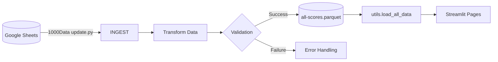

# TEG Data Flow Documentation

## Architecture Overview



## Core Data File Schemas

### all-scores.parquet vs all-data.* Key Differences

**Purpose:**
- `all-data.*` - Raw ingested data storage (direct from Google Sheets)
- `all-scores.parquet` - Processed analysis dataset

**Content Differences:**
| File/Field         | all-data.*          | all-scores.parquet      |
|--------------------|---------------------|-------------------------|
| Data State         | Raw, unprocessed    | Enriched/processed      |
| Calculated Fields  | None                | GrossVP, NetVP, Stableford, Cumulative metrics |
| HC Data            | Not merged          | Merged from handicaps.csv |
| Temporal Context   | Basic date          | Year derived, HoleID    |
| Storage Format     | Parquet + CSV mirror| Parquet only            |

### all-scores.parquet (Primary Analysis Dataset)
| Field Name         | Type    | Description                              | Source                          |
|--------------------|---------|------------------------------------------|---------------------------------|
| TEGNum             | int     | TEG edition number                       | Raw data                        |
| Round              | int     | Round number within TEG                  | Raw data                        |
| Hole               | int     | Hole number (1-18)                        | Raw data                        |
| Pl                 | string  | Player initials (AB/JB/DM etc)          | Raw data                        |
| Sc                 | int     | Raw score                                | Raw data                        |
| PAR                | int     | Course par for hole                      | Course data                     |
| SI                 | int     | Stroke index (difficulty ranking)       | Course data                     |
| HC                 | int     | Player handicap                          | handicaps.csv merge            |
| GrossVP            | int     | Gross score vs par (Sc - PAR)            | Calculated                      |
| NetVP              | int     | Net score vs par (Sc - HCStrokes - PAR)  | Calculated                      |
| Stableford         | int     | Stableford points                        | Calculated                      |
| Date               | date    | Round date                               | round_info.csv merge            |
| Course             | string  | Course name                              | round_info.csv merge            |
| HoleID             | string  | Unique hole identifier (T##|R##|H##)     | Generated                        |
| FrontBack          | string  | Front/Back nine                          | Generated (Hole < 10)           |
| *Cumulative fields | float   | 40+ cumulative metrics                   | add_cumulative_scores()          |


### all-data.parquet (Raw Data Storage)
| Field Name         | Type    | Description                              | Source                          |
|--------------------|---------|------------------------------------------|---------------------------------|
| TEGNum             | int     | TEG edition number                       | Raw data                        |
| Round              | int     | Round number within TEG                  | Raw data                        |
| Hole               | int     | Hole number (1-18)                       | Raw data                        |
| Pl                 | string  | Player initials                          | Raw data                        |
| Sc                 | int     | Raw score                                | Raw data                        |
| PAR                | int     | Course par for hole                      | Course data                     |
| SI                 | int     | Stroke index                             | Course data                     |
| Date               | date    | Round date                               | round_info.csv merge            |
| Course             | string  | Course name                              | round_info.csv merge            |
| TEG-Round          | string  | Composite TEG+Round identifier           | Generated                       |

### all-data.csv (Human-Readable Mirror)
| Field Name | Type   | Description                              |
|------------|--------|------------------------------------------|
| *          | *      | Mirrors all-data.parquet fields          |
| Year       | int    | Year derived from Date                   |
| Version    | string | Data version timestamp                   |

### handicaps.csv
| Field Name | Type   | Description                      |
|------------|--------|----------------------------------|
| TEG        | string | TEG identifier (TEG 1-TEG 50)   |
| AB         | int    | Alex Baker's handicap           |
| JB         | int    | Jon Baker's handicap            |
| DM         | int    | David Mullin's handicap         |
| GW         | int    | Gregg Williams' handicap        |
| HM         | int    | Henry Meller's handicap         |
| SN         | int    | Stuart Neumann's handicap       |
| JP         | int    | John Patterson's handicap       |
| GP         | int    | Graham Patterson's handicap     |

### round_info.csv
| Field Name | Type   | Description                      |
|------------|--------|----------------------------------|
| TEGNum     | int    | TEG edition number              |
| Round      | int    | Round number within TEG         |
| Date       | string | Round date (DD/MM/YYYY)         |
| Course     | string | Course name                      |
| Tees       | string | Tee box version used            |
| Format     | string | Competition format              |

## Streamlit Page Dependencies

```mermaid
flowchart TD
    classDef dataflow stroke:#4CAF50,stroke-width:2px;
    
    all-scores.parquet dataflow--> 101TEGHistory.py
    all-data.parquet dataflow--> 101TEGHistory.py
    all-scores.parquet dataflow--> 500Handicaps.py
    all-scores.parquet dataflow--> leaderboard.py
    
    all-data.csv -.->|Manual review| 1000Data_update.py
    handicaps.csv dataflow--> 500Handicaps.py
    round_info.csv dataflow--> utils.py
    
    utils.py --> 400scoring.py
    utils.py --> 300TEGRecords.py
```

## Data Transformation Pipeline
1. **Ingestion**: Google Sheets → `1000Data update.py`
2. **Reshaping**: Wide-to-long format conversion
3. **Merging**: Combine with handicaps + round info
4. **Calculations**: 
   - Stableford points
   - Cumulative scores
   - Performance metrics
5. **Storage**: Parquet + CSV mirror

## File Usage Locations

| File                | Used By                              | Purpose                                  |
|---------------------|--------------------------------------|------------------------------------------|
| all-scores.parquet  | 101TEGHistory.py, leaderboard.py     | Primary analysis dataset                 |
| all-data.parquet    | 1000Data_update.py, utils.py         | Raw data storage/versioning              |
| all-data.csv        | Manual reviews                       | Human-readable data inspection           |
| handicaps.csv       | 500Handicaps.py, utils.py            | Handicap calculations                    |
| round_info.csv      | 300TEGRecords.py, utils.py           | Round context metadata                   |

## Maintenance Guide
1. Add new TEG data: Update Google Sheets → Run `1000Data update.py`
2. Modify course data: Edit round_info.csv directly
3. Adjust handicaps: Update handicaps.csv → Reprocess data
