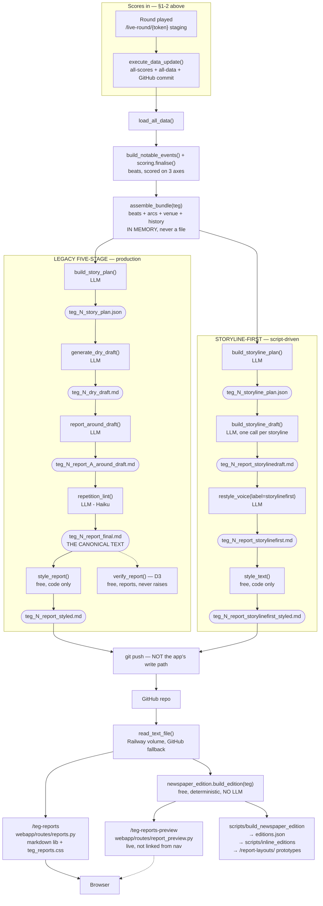

# Data Flow Map

Reference guide for how data flows from raw files through the analysis pipeline and into rendered pages.

**Maintenance note:** Update this file whenever data files are added, renamed, or restructured, or when the pipeline layers change.

---

## 1. Storage Layer

Raw data files in `data/`:

```
data/
  all-scores.parquet      ← 17-col hole-level data — the raw master (written directly by add/delete)
  all-data.parquet        ← 53-col hole-level data — fully regenerated from all-scores on every add/delete
  round_info.csv          ← course / date / area metadata per TEG+Round
  handicaps.csv           ← player handicaps per TEG
  players.csv             ← player identity (Code, Name) — writable source of truth; seeded from the legacy PLAYER_DICT
  course_pars.csv         ← hole-level Par/SI per course, backfilled from history (scripts/backfill_course_pars.py)
  round_pars.csv          ← hole-level Par/SI per *specific* TEG+Round, set up by an admin before the round is played
  live_rounds.csv         ← registry of every live (in-progress, multi-device) round entry session ever started
  live_rounds/{token}.csv ← per-live-round staging: current per-cell state, volume-only until finalize
  streaks.parquet         ← pre-computed streak counters per hole per player
  bestball.parquet        ← pre-computed per-round bestball/worstball totals (read by the webapp for all-time ranking; rebuilt on every add/delete)
  commentary_*.parquet    ← AI-generated commentary (round/tournament summaries, streaks)
  commentary/             ← the LLM report pipeline's artefacts (see below) — markdown + story-plan JSON
  commentary/variants/    ← per-model artefact sets for comparison runs — GITIGNORED
  llm_mailbox/            ← prompt hand-off for `--plan` / `--paste` report runs — GITIGNORED, transient
```

`all-scores.parquet` and `all-data.parquet` are both hole-level at the same granularity, but the relationship is master → derived, not two independent sources: `all-data` is regenerated wholesale from `all-scores` (+ `round_info.csv` for Date/Course, + cumulative/ranking columns) by `update_all_data()` (`teg_analysis/analysis/pipeline.py`) on every add/delete, so it carries no information that isn't derivable from `all-scores`. Both are still stored (rather than deriving `all-data` on load) since the store costs nothing and keeps webapp reads decoupled from the transform chain. A third copy, a plain-CSV mirror of `all-data` (`data/all-data.csv`, "manual review" copy), was retired — nothing read it and it dominated the size of every data-update GitHub commit (~2.5 MB vs ~40 KB for the parquet).

`course_pars.csv` is backfilled from `all-scores` + `round_info` history (`scripts/backfill_course_pars.py`) using **the most recently played round at each course**, not majority vote — a course can be legitimately re-rated over time, so recency is a better default than historical agreement, and it naturally covers courses with too little history for a majority (e.g. Estoril, only 2 rounds ever). All 26 courses are populated. Praia D'El Rey is flagged (`KNOWN_VARIABLE_ROUTING` in the script) because it's sometimes played back-9-first — confirmed with Jon this is real variation, not an error — so its entry is just the usual routing, not a guarantee; pre-round setup should prompt a double-check for it specifically. `course_pars.csv` is edited like any other metadata CSV via `/admin/edit-data`.

`course_pars.csv` is a *course-level default*. `round_pars.csv` (below) is the actual per-round Par/SI, confirmed by an admin before a round is played — that's what round entry reads from, not `course_pars.csv` directly. See `DATA_STORAGE_INGESTION_PLAN.md`.

`commentary/` holds the report pipeline's output. **Two pipelines write into it** and their
artefacts sit side by side (full map: [§10](#10-report-build--scores--published-report)):

- **Legacy five-stage** — `teg_N_story_plan.json` → `_dry_draft.md` → `_report_A_around_draft.md` →
  `_report_final.md` → `_report_styled.md`, the same set with a `round_R_` infix for round reports.
  All 17 TEGs. `_report_styled.md` is the only one `/teg-reports` reads.
- **Storyline-first** — `teg_N_storyline_plan.json` → `_report_storylinedraft.md` →
  `_report_storylinefirst.md` → `_report_storylinefirst_styled.md`. TEGs 14, 16 and 18 only. These
  are the input to the newspaper edition, not to `/teg-reports`.

Plus experiment snapshots and archived generations. Two sibling directories are **gitignored and
safe to delete**: `commentary/variants/<name>/` is a parallel artefact set for one model
(`TEG_REPORT_VARIANT` / `--variant` / `--paste`), promoted into `commentary/` with
`reporting.paths.promote_variant` when it wins; `llm_mailbox/` is transient prompt hand-off state for
`--plan` and `--paste` runs (one directory per run: `run.json`, per-call `request.md` / `response.*`, a
`FINISHED` marker). Neither is written by `write_file` and neither goes to the Railway volume — report
generation is offline-only. Full reference: `teg_analysis/reporting/ARTEFACTS.md`.

`live_rounds.csv` / `live_rounds/{token}.csv` back multi-device live round entry (`teg_analysis/analysis/live_round.py`, `/live-round/{token}`) — an admin starts a live round for an already-set-up TEG+Round, gets a shareable link, and players enter scores from their own phones with the server (not client clocks) arbitrating write order and flagging genuine conflicts. The per-round staging file is written `defer_github=True` on every score entry (volume-only, never committed — it's a staging area, not the record) and is archived once finalized, at which point its scores are converted to the same long-format shape the "add a round" flow uses and written via the existing `execute_data_update` — one GitHub commit, same as any other round addition. See `DATA_STORAGE_INGESTION_PLAN.md`, "Phase 3.4 design", for the full model (conflict resolution, polling, device identity).

---

## 2. I/O Layer

File reading abstraction in `teg_analysis/io/file_operations.py`:

```
read_file(path)
  ├─ Local dev    →  pd.read_parquet/csv from data/
  └─ Railway      →  check Railway volume → if missing, pull from GitHub API → cache to volume

write_file(path, df)  →  Railway volume  +  GitHub commit
```

**Write pipeline (UI-agnostic):** `teg_analysis/analysis/data_update.py` provides the
headless add / edit / delete flows:
- **Add:** `process_google_sheets_data` → `find_duplicate_keys` → `execute_data_update`,
  which takes a **timestamped backup** of `all-scores`/`all-data` under `data/backups/`,
  writes `all-scores`/`all-data`, regenerates the streaks / commentary / bestball /
  TEG-status caches, and batch-commits to GitHub.
- **Delete:** `preview_deletion_data` → `execute_data_deletion`, which takes the same
  **timestamped backup** of `all-scores`/`all-data` under `data/backups/`, removes
  the selected TEG/rounds from `all-scores`/`all-data`, and rebuilds the same derived
  caches.
- **Edit:** `EDITABLE_DATA_FILES` registry + `save_data_file` (single-file commit of
  an edited metadata CSV) and `regenerate_status_files` (rebuild completed/in-progress
  status from raw data).

On Railway each flow writes to the volume first then makes a single GitHub batch
commit; locally it writes straight to `data/`. The legacy Streamlit data-admin pages
and the webapp admin pages (`webapp/routes/admin.py`) drive this same pipeline (so it
is no longer Streamlit-only).

**Selective sync (UI-agnostic):** `teg_analysis/io/sync.py` moves individual files
between GitHub and the app's store (the Railway volume in production, the local working
tree in dev) at byte level. `build_sync_status(folder)` compares a folder across both
sides (presence + size); `pull_files` copies GitHub → store; `push_files` copies
store → GitHub in a single batch commit. This is how reference CSVs for a new TEG can
be synced individually without a full data update. Driven by the webapp
`/admin/volume-sync` page. Each pull backs up the existing store file to
`data/backups/sync/<timestamp>/` before overwriting (`backup_store_file` /
`restore_backup`), and `detect_pull_conflicts` / `detect_push_conflicts` warn before
overwriting a destination copy that is newer than the source. Before a pull/push runs,
`build_sync_preview(action, folder, names)` summarises per file what will happen
(create vs overwrite, store-vs-GitHub modified times, which side is newer, conflict
flag); `file_diff(folder, name)` returns a unified text diff (store vs GitHub) for
diffable extensions (`.csv/.md/.txt/.json`).

**Volume browsing + delete:** `list_store_dir(rel)` lists a store directory (dirs
then files, with size/mtime) for the webapp `/admin/volume` browser;
`read_store_file(rel)` returns bytes for download; `delete_store_file(rel)` removes a
store file after taking a backup under `data/backups/sync/<timestamp>/`. All validate
the path against traversal (`_safe_rel`). `restore_backup` likewise backs up the copy
it replaces, and `backups_for(rel)` filters the backup list to one file — surfaced by
the `/admin/backups` page.

**Report files + the regeneration-refresh gap:** tournament/round commentary
(`data/commentary/**/*_report*.md`) is generated by an *offline* pipeline and
reaches GitHub via a plain `git push`, not the app's write path — so the app
never sees it change. `webapp/routes/reports.py` reads these through the
volume-aware `read_text_file` (volume-first, GitHub fallback + cache), and drives
TEG/round *discovery* from `data/completed_tegs.csv` (there's no volume-aware
directory listing). This means a **new** report is pulled and cached on first
view automatically. What that path can't do is refresh a **regenerated** report
(same filename, new content) — the volume already holds a now-stale cached copy.
`sync.sync_report_files()` is that refresh lever: it re-pulls every report file
from GitHub, overwriting the store copy (backup first). It's wired to the admin
**"Sync all reports from GitHub"** button on `/admin/volume-sync`. Only files
matching the report naming patterns are synced (`_REPORT_FILE_PATTERNS`), not
every draft/version `.md` sharing the folder.

**File catalog (reference only):** `teg_analysis/io/file_catalog.py`
(`DATA_FILE_CATALOG`) describes each data file — role, format, how it's updated,
importance, editable slug. It's the single source for the webapp `/admin/file-guide`
page and the info icons on the sync/volume pages. Keep it in step with this file and
`constants.py` when data files change.

---

## 3. Core Data Loader

`teg_analysis/core/data_loader.py` — loads hole-level baseline data:

```
load_all_data(exclude_teg_50, exclude_incomplete_tegs)
  1. read_file("data/all-data.parquet")          → 53-col hole-level df
  2. read_file("data/round_info.csv")            → merge Area column
  3. optionally filter TEGs
  ▼
[hole-level df, 6390 rows × 53 cols]

Key columns: Pl, Player, TEGNum, Round, Hole, Sc, PAR, GrossVP, NetVP,
             Stableford, HoleID, FrontBack, Year, Course, Area,
             cumulative stats (*Cum*), running averages (*Avg*), Career Count
```

---

## 4. Aggregation Layer

`teg_analysis/analysis/aggregation.py` — sums scores at different levels:

```
hole-level df
  │
  ├─ aggregate_data(df, "Round")     → round-level df    (Player+TEG+Round+Course+Date…)
  │    └─ get_round_data()           ← convenience wrapper
  │
  ├─ aggregate_data(df, "TEG")       → TEG-level df      (Player+TEG+Year+Area…)
  │    └─ get_complete_teg_data()    ← excludes incomplete TEGs
  │
  └─ aggregate_data(df, "FrontBack") → 9-hole df         (Player+TEG+Round+FrontBack…)
       └─ get_9_data()               ← convenience wrapper
```

---

## 5. Rankings Layer

`teg_analysis/analysis/rankings.py` — adds rank columns:

```
add_ranks(df)
  ├─ Rank_within_player_Sc
  ├─ Rank_within_player_GrossVP
  ├─ Rank_within_player_NetVP
  ├─ Rank_within_player_Stableford
  ├─ Rank_within_all_Sc
  ├─ Rank_within_all_GrossVP
  ├─ Rank_within_all_NetVP
  └─ Rank_within_all_Stableford

Convenience wrappers:
  get_ranked_teg_data()       = get_complete_teg_data()  + add_ranks()
  get_ranked_round_data()     = get_round_data()         + add_ranks()
  get_ranked_frontback_data() = get_9_data()             + add_ranks()
```

---

## 6. Analysis Functions (On-Demand)

Called directly, not cached in deps:

```
teg_analysis/analysis/
  history.py
    ├─ get_teg_winners(all_data)       → Trophy / Jacket / Spoon per TEG
    ├─ get_eagles_data(all_data)       → eagle records
    └─ get_holes_in_one_data(all_data) → HiO records

  streaks.py
    ├─ build_streaks(all_data)         → streak counters per hole per player
    ├─ get_max_streaks(streaks_df)     → career best per player
    └─ get_current_streaks(streaks_df) → current ongoing streaks

  scoring.py
    ├─ calculate_par_performance_matrix() → avg GrossVP by par type
    └─ count_scores_by_player()          → score frequency distribution
```

---

## 7. Webapp Caching Layer

`webapp/deps.py` — `@lru_cache(maxsize=1)` wrappers, no TTL, cleared manually:

```
cached_load_all_data()         → hole-level df  (53 cols)
cached_round_data()            → round-level df
cached_complete_teg_data()     → TEG-level df   (complete TEGs only)
cached_9_data()                → 9-hole df
cached_ranked_teg_data()       → TEG-level df   + rank cols
cached_ranked_round_data()     → round-level df + rank cols
cached_ranked_frontback_data() → 9-hole df      + rank cols

Helpers:
  create_leaderboard(df, col)  → pivot Player×Round → totals → ranks
  format_value(val, field)     → styled string
  get_default_teg_num()        → latest TEG
```

---

## 8. HTTP Request → Response Flow

### Leaderboard
```
GET /leaderboard
  ├─ theme_middleware  →  request.state.theme
  ├─ routes/leaderboard.py
  │   ├─ cached_round_data()      filter to selected TEG
  │   ├─ create_leaderboard(df)   pivot Player×Round → totals
  │   ├─ _build_table_html(df)    → HTML string
  │   └─ TemplateResponse("leaderboard.html", ctx)
  └─ Browser

GET /leaderboard/table  (HTMX swap)
  └─ TemplateResponse("partials/leaderboard_table.html", ctx)
```

### Records
```
GET /records/tab/{tab_name}  (HTMX swap)
  ├─ routes/records.py
  ├─ cached_ranked_*_data()  or  cached_load_all_data()
  ├─ prepare_records_table() / prepare_streak_records_table()
  │  (teg_analysis/display/formatters.py)
  ├─ _build_records_html(df)     → HTML string
  └─ TemplateResponse("partials/records_tab.html", ctx)
```

### Charts
```
GET /charts
  ├─ routes/charts.py
  ├─ cached_load_all_data()
  ├─ create_cumulative_graph()  (webapp/chart_utils.py)  → Plotly Figure
  ├─ fig.to_json()
  └─ TemplateResponse("charts.html", {figure_json: …})
```

### Player Page
```
GET /player/{code}
  ├─ routes/player.py
  ├─ cached_ranked_teg_data() + cached_round_data() + cached_load_all_data()
  ├─ get_teg_winners(), get_eagles_data(), build_streaks()  (called directly)
  ├─ _build_stat_cards(), _build_trophy_cabinet(), _build_overview_context()
  └─ TemplateResponse("player.html", ctx)
```

---

## 9. Full End-to-End

```
[GitHub repo]  ←──────────────────────────── write_file() / execute_data_update()
     │
     │  read_from_github() (Railway first-boot or cache miss)
     ▼
[Railway volume / local data/]
     │
     │  read_file()
     ▼
[all-data.parquet]  +  [round_info.csv]
     │
     │  load_all_data()
     ▼
[hole-level df, 53 cols]
     │
     ├──────────────────────────────────────────────────────────────┐
     │  aggregate_data()    │  aggregate_data()    │  aggregate_data()
     ▼                      ▼                       ▼
[round df]           [TEG df]                [9-hole df]
     │                   │                       │
     │  add_ranks()      │  add_ranks()          │  add_ranks()
     ▼                   ▼                       ▼
[ranked round df]   [ranked TEG df]      [ranked 9-hole df]
     │                   │                       │
     └───────────────────┴───────────────────────┘
                         │
              webapp/deps.py  @lru_cache wrappers
                         │
              webapp/routes/*.py  (filter, pivot, format)
                         │
              Jinja2 templates  (HTML + Plotly JSON)
                         │
                    Browser
```


---

## 10. Report build — scores → published report

Sections 1–9 end at a rendered *page*. This one follows the other output: the written tournament
report. It is the whole path in one place — every hop, what it writes, what reads that, and whether
it costs an LLM call. **How each stage works is not here**: mechanics, prompts and per-stage costs
live in `teg_analysis/reporting/README.md`; per-file detail in that folder's `ARTEFACTS.md`.

**There are two report pipelines, and telling them apart is the thing that trips people up.**

| | Legacy five-stage | Storyline-first |
|---|---|---|
| Status | **Current production.** All 17 TEGs (2–18) | **Newer method, script-driven.** TEGs 14, 16, 18 |
| Runs via | `python -m teg_analysis.reporting.backfill --tegs N` | `python scripts/storyline_full_report_experiment.py --tegs N` |
| Shape | one flowing document, rounds as blocks | one lead story + separate articles |
| Final artefact | `teg_N_report_styled.md` | `teg_N_report_storylinefirst_styled.md` |
| Reaches a reader via | `/teg-reports` — **live** | the newspaper edition — **not live yet**, see below |

Neither has replaced the other. The legacy chain is what the site serves today; storyline-first is
what the settled newspaper layout is built on, and switching `/teg-reports` over to it is the open
decision (`webapp/report_layout_prototypes/README.md` → "Still to do").

### The path


```mermaid
flowchart TD
    subgraph entry ["Scores in — §1-2 above"]
        A["Round played<br/>/live-round/{token} staging"] --> B["execute_data_update()<br/>all-scores + all-data + GitHub commit"]
    end

    B --> C["load_all_data()"]
    C --> D["build_notable_events() + scoring.finalise()<br/>beats, scored on 3 axes"]
    D --> E["assemble_bundle(teg)<br/>beats + arcs + venue + history<br/>IN MEMORY, never a file"]

    subgraph legacy ["LEGACY FIVE-STAGE — production"]
        L1["build_story_plan()<br/>LLM"] --> L1f(["teg_N_story_plan.json"])
        L1f --> L2["generate_dry_draft()<br/>LLM"] --> L2f(["teg_N_dry_draft.md"])
        L2f --> L3["report_around_draft()<br/>LLM"] --> L3f(["teg_N_report_A_around_draft.md"])
        L3f --> L4["repetition_lint()<br/>LLM - Haiku"] --> L4f(["teg_N_report_final.md<br/>THE CANONICAL TEXT"])
        L4f --> L5["style_report()<br/>free, code only"] --> L5f(["teg_N_report_styled.md"])
        L4f -.-> LV["verify_report() — D3<br/>free, reports, never raises"]
    end

    subgraph storyline ["STORYLINE-FIRST — script-driven"]
        S1["build_storyline_plan()<br/>LLM"] --> S1f(["teg_N_storyline_plan.json"])
        S1f --> S2["build_storyline_draft()<br/>LLM, one call per storyline"] --> S2f(["teg_N_report_storylinedraft.md"])
        S2f --> S3["restyle_voice(label=storylinefirst)<br/>LLM"] --> S3f(["teg_N_report_storylinefirst.md"])
        S3f --> S4["style_text()<br/>free, code only"] --> S4f(["teg_N_report_storylinefirst_styled.md"])
    end

    E --> L1
    E --> S1

    L5f --> P["git push — NOT the app's write path"]
    S4f --> P
    P --> G["GitHub repo"]
    G --> R["read_text_file()<br/>Railway volume, GitHub fallback"]

    R --> W1["/teg-reports<br/>webapp/routes/reports.py<br/>markdown lib + teg_reports.css"]
    R --> NE["newspaper_edition.build_edition(teg)<br/>free, deterministic, NO LLM"]

    NE --> W2["/teg-reports-preview<br/>webapp/routes/report_preview.py<br/>live, not linked from nav"]
    NE --> PR["scripts/build_newspaper_edition<br/>→ editions.json<br/>→ scripts/inline_editions<br/>→ /report-layouts/ prototypes"]

    W1 --> BR["Browser"]
    W2 -.-> BR
```

### Hop by hop

Everything above `assemble_bundle` is shared; everything below it forks.

| # | Step | Writes | Read by | LLM? |
|---|---|---|---|---|
| 1 | Round entered and finalized (`live_round.py`) or added via `/admin/new-round` | `all-scores.parquet`, `all-data.parquet` (+ GitHub commit) | everything downstream | no |
| 2 | `load_all_data()` → `build_notable_events()` → `scoring.finalise()` | *(memory)* — scored "beats" | the bundle | no |
| 3 | `assemble_bundle(teg)` adds arcs, venue, career/course history, win anatomy | *(memory)* — **the bundle is not a file** | stages 4L / 4S | no |

**Legacy five-stage** — one `backfill.py` run does 4L–8L end to end:

| # | Step | Writes | Read by | LLM? |
|---|---|---|---|---|
| 4L | `build_story_plan()` | `teg_N_story_plan.json` | 5L, 6L, 8L | **yes** |
| 5L | `generate_dry_draft()` — facts only, deliberately unstyled | `teg_N_dry_draft.md` | 6L | **yes** |
| 6L | `report_around_draft()` — the voice pass | `teg_N_report_A_around_draft.md` | 7L | **yes** |
| 7L | `repetition_lint()` | `teg_N_report_final.md` — **canonical** | 8L, D3 | **yes** (Haiku) |
| — | `verify_report()` — D3 mechanical checks | *(findings printed)* | you | no |
| 8L | `style_report()` — standings, records, CSS hooks | `teg_N_report_styled.md` | `/teg-reports` | no |

**Storyline-first** — `scripts/storyline_full_report_experiment.py --tegs N` does 4S–7S. `--from` picks where to start and `--to` where to stop, so you only pay for the stages you are changing: `--from draft` re-enters at 5S reusing the plan, `--from voice` at 6S reusing the draft, `--to storylines` stops after 4S. Same freeze-and-restart idea as the legacy chain's restart recipes — full table in `teg_analysis/reporting/README.md` → *Running only the stages you need*:

| # | Step | Writes | Read by | LLM? |
|---|---|---|---|---|
| 4S | `build_storyline_plan()` — 3 mandatory + 0–3 discovered storylines, each with `chosen_headline` and `standfirst` | `teg_N_storyline_plan.json` | 5S, 11b | **yes** |
| 5S | `build_storyline_draft()` — one section per storyline. Each writer sees **only** that storyline's own cited beats (`evidence`) **plus scoped context**: venue character, and career and course history for that storyline's players only, numbers-only. **This is where course detail and history enter the prose** — there is no separate enrichment step | `teg_N_report_storylinedraft.md` | 6S | **yes**, one call per storyline |
| 6S | `restyle_voice(label="storylinefirst", source_label="storylinedraft")` | `teg_N_report_storylinefirst.md` | 7S | **yes** |
| 7S | `style_text()` inside the same call | `teg_N_report_storylinefirst_styled.md` | 9, 11b | no |

`style_text()` calls `authoring.load_story_or_storyline_plan()`, which reads the legacy
`teg_N_story_plan.json` if present and falls back to `teg_N_storyline_plan.json` otherwise — so 7S
runs on any TEG that has *either* plan, not just the three with both.

**Round reports** run the same five stages against one round, writing the same filenames with a
`round_R_` infix (`round_report.py`). `/teg-reports` reads them the same way. Storyline-first has no
round equivalent.

**Publication** — the same for both, and it is *not* the app's write path:

| # | Step | Writes | Read by | LLM? |
|---|---|---|---|---|
| 9 | `git push` — report generation is offline; nothing goes through `write_file` | GitHub | the webapp | no |
| 10 | `read_text_file()` — volume first, GitHub fallback, caches the hit | Railway volume | the routes | no |
| 11a | `/teg-reports` renders `teg_N_report_styled.md` through the `markdown` library | HTML | the reader | no |
| 11b | `newspaper_edition.build_edition(teg)` parses the styled MD **plus** the storyline plan into one edition dict | *(memory)* | 12a, 12b | no |
| 12a | `render_desktop_html()` + edition JSON → `/teg-reports-preview` | HTML | the reader — live, but not linked from the nav | no |
| 12b | `scripts/build_newspaper_edition` → `editions.json`, then `scripts/inline_editions` inlines it into the prototype pages | `editions.json`, `composite.html` etc. | `/report-layouts/` | no |

> `/teg-reports-preview` was unreachable for a merge regression (its router was dropped from
> `webapp/app.py`); **fixed on `main` in `bb614c0`.** It renders, but is deliberately not linked
> from the nav, and only TEGs 14/16/18 have the artefacts it needs.

### Three things that are easy to get wrong

**The bundle is not a file.** Stages 4L and 4S each assemble it in memory and send it in full. Dump
it without spending anything with `build_story_plan(teg, dry_run=True)`.

**Editing a styled file is pointless.** `_report_styled.md` is regenerated from `_report_final.md`
every time `style_report()` runs. Edit the canonical text, then re-style.

**Merging to `main` does not update the site.** Railway serves from a volume that already holds a
cached copy of a report at that filename, and reports never travel through the app's write path.
A *new* report is pulled on first view; a *regenerated* one needs **"Sync all reports from GitHub"**
on `/admin/volume-sync` (`sync.sync_report_files()`, §2 above).
